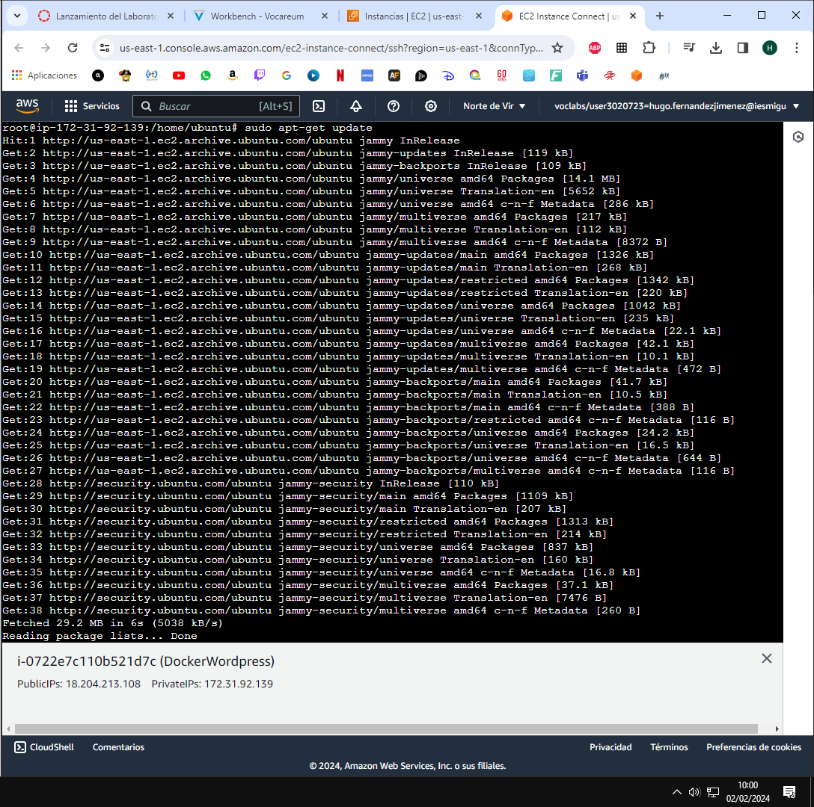
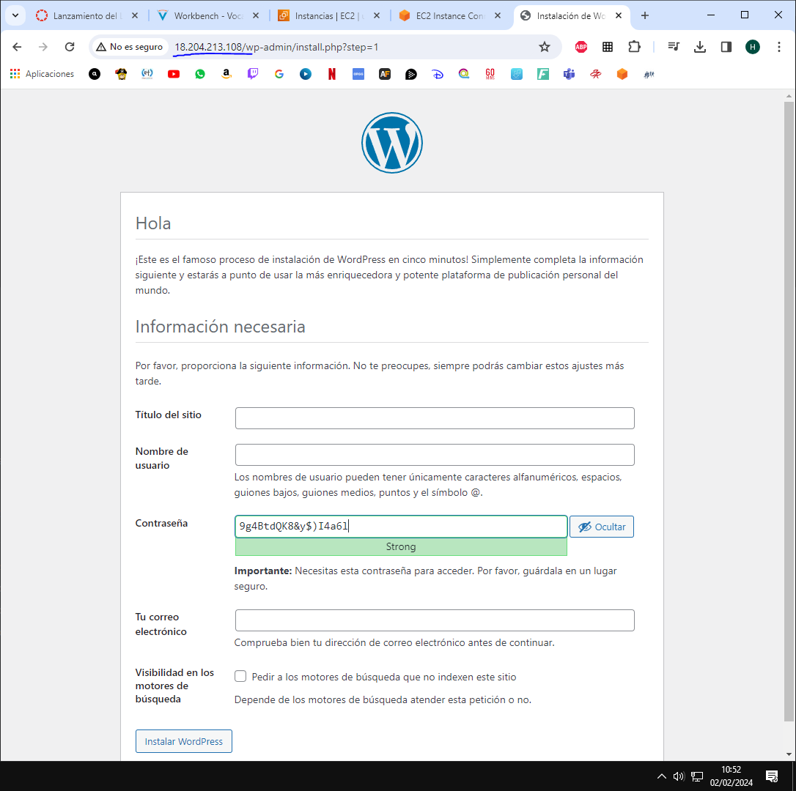
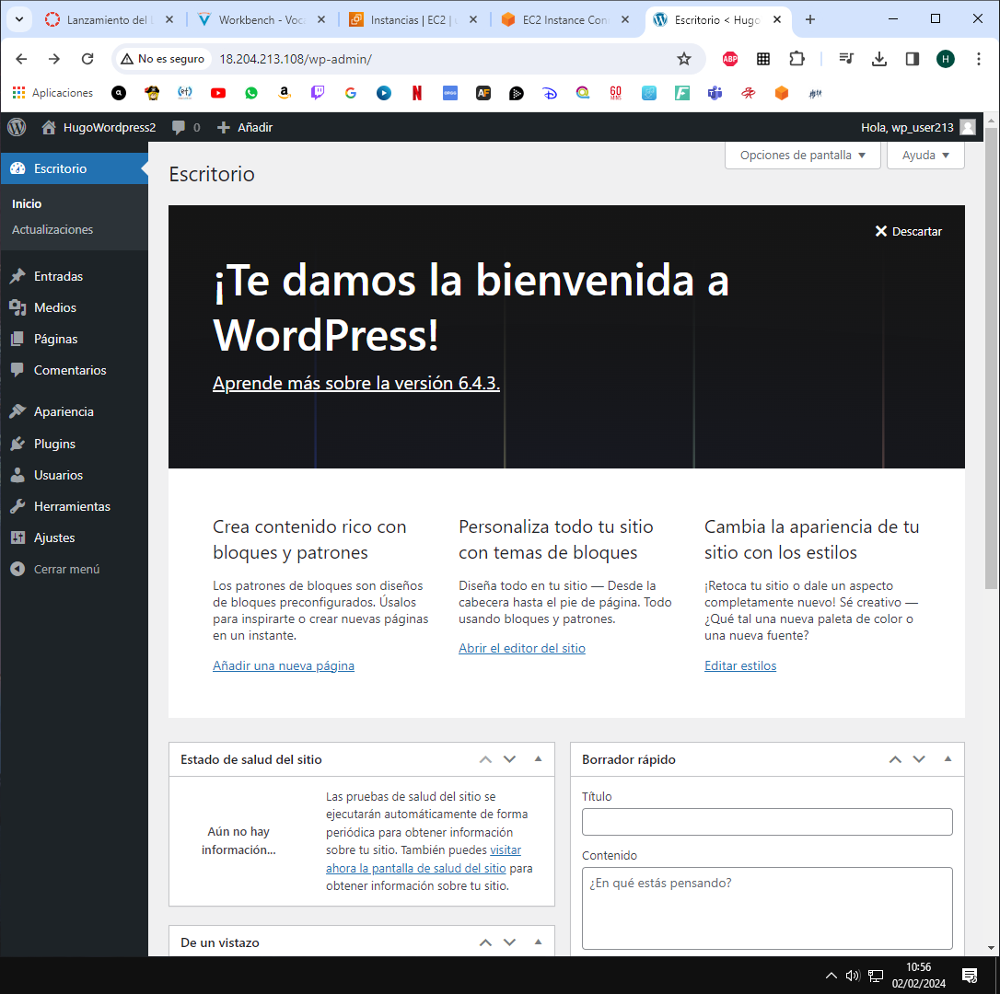

# Actividad13_LAMP_docker

## Lo primero quitamos los archivos en conflicto:
  
##  Hacemos un apt-get update:

## Instalamos el certificado:

## Instalamos las gpg keys:

## Añadimos los repositorios APT sourcer:

## Instalamos el motor Docker:

## Comprobamos instalación dockers:

## Instalamos la versiond el compose:

## Ejecutamos hello world desde docker:

## Gestionamos el docker:

## Instalamos el docker compose:

## Comprobamos que funcione:

## Ejecutamos docker compose up:

## Comprobamos que nos deje entrar:

## Hacemos docker compose ps y docker compose up:

## Usamo el docker compose:

## Y comprobamos la configuración:
